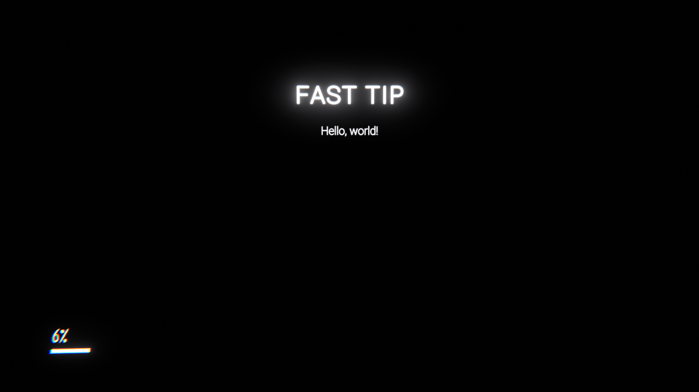

# TGA Example Mod (BepInEx)

### About BepInEx
BepInEx is a mod loader designed to make mods easier to use

Instead of having to manage several versions of the game assembly, you can chose mods on the fly, and use multiple mods together.

It does this by loading mod DLL files at runtime, and using a tool called Harmony to patch game classes in memory, instead of hard patching the assemblies on disk. Harmony also has the advantage of preventing mods from overwriting each other's code. If there is a fundamental incompatibility between yours and someone else's mod, you can specify it and prevent your mod from loading and interfering with others.

BepInEx also provides several APIs for logging, configuration and interacting with the mod loader

### Useful links
- [Harmony 2 documentation](https://harmony.pardeike.net/index.html)
- [BepInEx 6 documentation](https://docs.bepinex.dev/v6.0.0-pre.1/)
- [TGA Modding docs (WIP)](https://tga-modding.github.io/docs/)

### Setup
1. Clone the repository, and open it in your preferred IDE
2. Copy the game libraries (`<game folder>/The Glitched Attraction_Data/Managed`) to the Ref folder in the project:
    - Assembly-CSharp.dll
    - UnityEngine.dll
    - UnityEngine.CoreModule.dll
3. Copy BepInEx libraries (`<game folder>/BepInEx/core`) to the Ref folder
    - BepInEx.Core.dll
    - BepInEx.Unity.dll
    - 0Harmony.dll
4. All of the class not found errors should go away

### Screenshots

